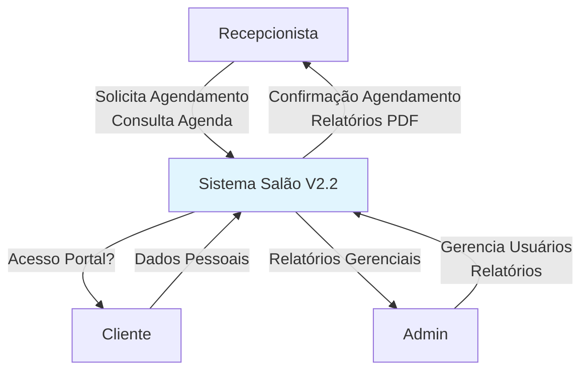
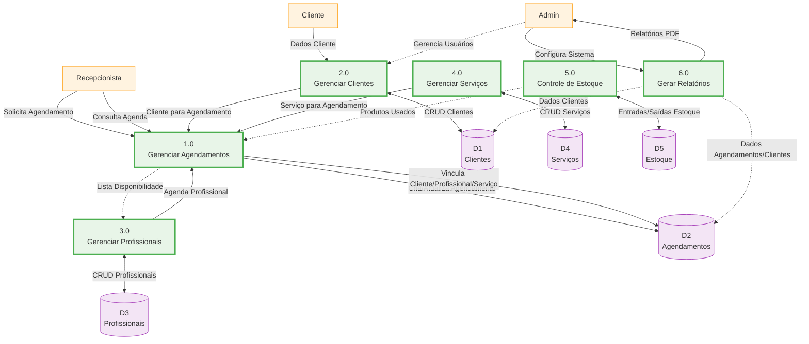

# 📊 Diagrama de Fluxo de Dados (DFD) - Salão V2.2

## 🗺️ DFD Nível 0 - Diagrama de Contexto

Diagrama de contexto mostrando o sistema como um processo único interagindo com entidades externas.



## 🔍 DFD Nível 1 - Decomposição Principal

Decomposição em processos principais com fluxos de dados e repositórios.



## 📋 Legenda
| Símbolo | Descrição |
|---------|-----------|
| `Retângulo` | **Entidade Externa** (Usuários reais) |
| `Círculo/Elipse` | **Processo** (Função do sistema) |
| `Retângulo aberto` | **Repositório de Dados** (Banco SQLite) |
| `Seta` | **Fluxo de Dados** |
| `Linha tracejada` | **Fluxo de Controle** |

## 🔗 Fluxos Principais Detalhados

### 1. Fluxo de Agendamento (Core)
```
Recepcionista → [1.0 Gerenciar Agendamentos] ← Clientes
                      ↓
             [Consulta Profissionais/Serviços]
                      ↓
                 Salva em D2 (Agendamentos)
                      ↓
              Atualiza Estoque (se produtos)
```

### 2. Geração de Relatórios
```
Admin → [6.0 Relatórios] → Consulta D1,D2,D3 → PDF → Admin
```

## 📈 Observações
- **Banco Centralizado**: SQLite `db.sqlite3` contém todos repositórios (D1-D5).
- **Segurança**: Recepcionista tem acesso restrito (sem relatórios).
- **Integrações**: Calendário visual, PDFs via ReportLab.

**Visualize no VSCode**: Instale extensão "Mermaid Preview" ou abra no GitHub!


